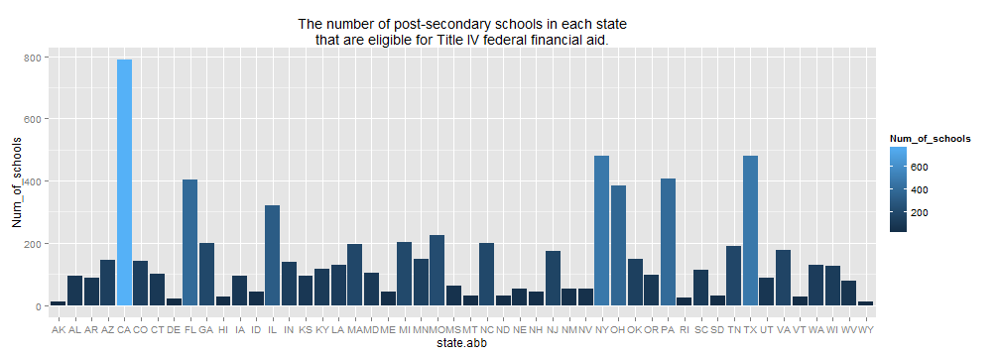

## Introduction

Using this interactive app, a user can learn about the number of schools in their state for post-secondary education that qualify for Title IV federal financial aid.

[Locating Post-Secondary Schools by State App](http://shelleystall.shinyapps.io/DataProd/)

# Purpose:

Choosing a school has many parameters. One of which is the physical location.  This app provides a means of visualizing all the post-secondary schools that are eligible to offer federal assistance within a selected state.

# Objectives: 

Assist the high-school student with understanding where potential schools are located in a given state to assist with college choice.

--- 

## Reproducibility Aspects

The U.S. Department of Education collects, manages, and makes available detailed information about each school that qualifies for Title IV. Data is free to download at inventory.data.gov. It's accompanied by a detailed data dictionary. The app documentation includes the link to the dataset.  All data tidying activities are performed within the app.

- [Link to Department of Education school data at inventory.data.gov](http://inventory.data.gov/dataset/032e19b4-5a90-41dc-83ff-6e4cd234f565/resource/38625c3d-5388-4c16-a30f-d105432553a4/download/postscndryunivsrvy2013dirinfo.csv)

Additional information about federal financial aid: The U.S. Department of Education awards about $150 billion a year in grants, work-study funds, and low-interest loans to more than 15 million students. Federal student aid covers such expenses as tuition and fees, room and board, books and supplies, and transportation. Aid also can help pay for other related expenses, such as a computer and dependent care. Thousands of schools across the country participate in the federal student aid programs.  

---

## Fun Usage Tips

# Information Tab

On the first tab, the student can explore the schools from a selected state as identified on the state map.  The markers contain the name of the school.  In many cases if you get to street level, the school is identified on the Google map, and you can select the Google information which provides a school rating. 

# US Maps Tab

The US Map tab has an interactive map showing each state and the number of eligible schools in that state. Hover over a state, and the information will show the name of the state along with the number of Title IV eligible schools.
                                 
# App Documentation Tab

The App Documentation tab has more information on Title IV and the types of loans and grants. The data used for this app is available on inventory.data.gov.  The data allows you to explore the location of post-secondary schools that are allowed to participate in any of the Title IV federal student financial assistance programs.

---

## Data Visualization

The initial set of data is grouped by state and converted to a table.  This makes determining the number of schools for each state very simple and fast. Here you can clearly see the highest number is in California.  

 

